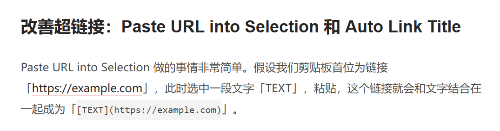

我也不知道为什么要起这个名字，可能是受到早年间在知乎刷到类似文章的影响，具体来说其实就是当作日记来写

首先需要寻找 Obsidian 是否有加密的插件

上传图片测试

==高亮显示==

测试停止编辑自动推送

图片测试

测试有意思的插件

2025-05-06 你好

[这十多个插件，大幅度改善你的 Obsidian 编辑体验 - 少数派](https://sspai.com/post/68394)

- [ ] 测试